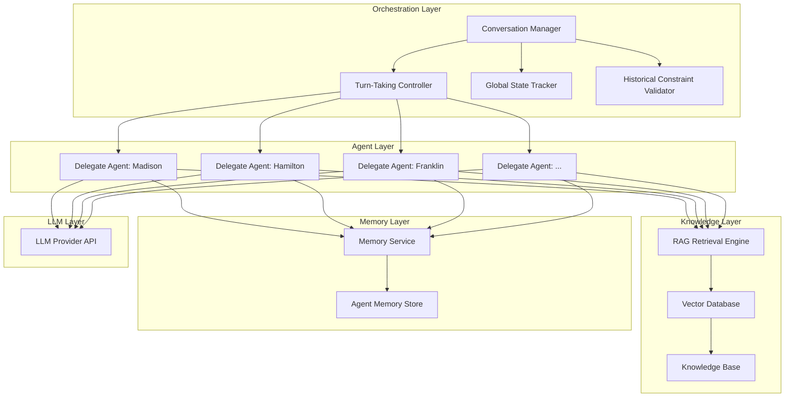
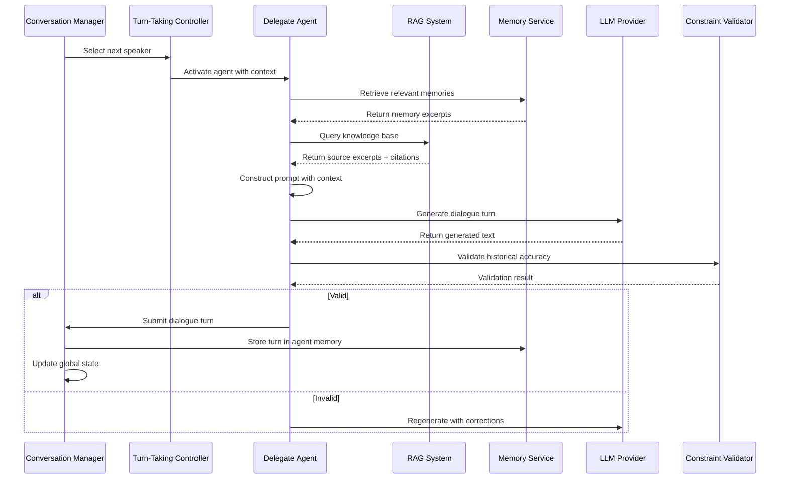
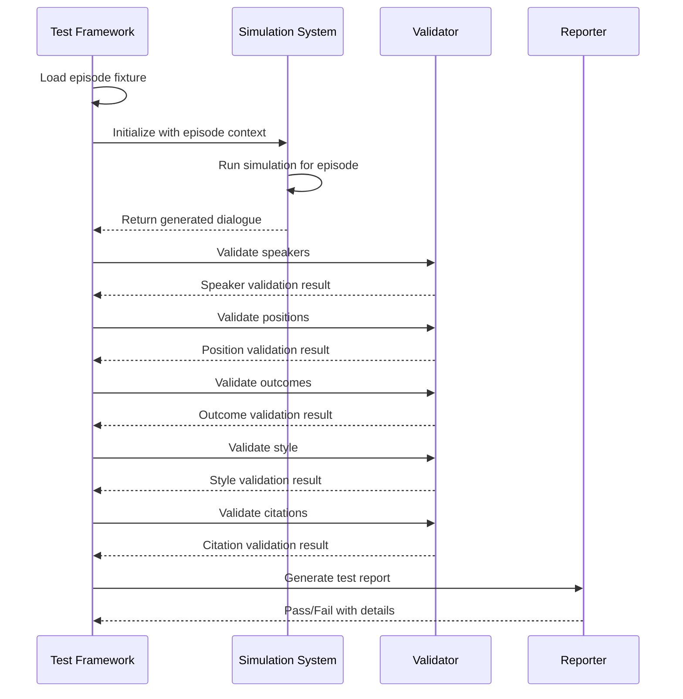

# Design Document: Constitutional Convention Simulation System

## Overview

The Constitutional Convention Simulation System is a sophisticated multi-agent LLM application that recreates the 1787 Philadelphia Constitutional Convention through historically grounded dialogue. The system orchestrates 55 delegate agents, each representing a specific historical figure with authentic personality, ideology, and speaking patterns. All dialogue is strictly anchored in primary sources through Retrieval-Augmented Generation (RAG), with comprehensive citation of historical documents.

The architecture follows a modular design with four primary subsystems:
1. **Delegate Agent System** - Individual LLM agents with personality modeling and memory
2. **Knowledge Base & RAG System** - Vector-indexed historical documents with semantic retrieval
3. **Conversation Orchestration System** - Central manager for turn-taking, state, and constraints
4. **Memory & Persistence System** - Long-term storage of agent memories and global state

## Architecture

### High-Level System Architecture



### Component Interaction Flow



## Components and Interfaces

### 1. Delegate Agent Component

Each delegate agent is an independent module representing a historical figure.

**Interface:**
```typescript
interface DelegateAgent {
  // Agent identification
  name: string;
  state: string;
  role: string;
  
  // Generate a dialogue turn
  generateTurn(context: TurnContext): Promise<DialogueTurn>;
  
  // Update agent's memory with new information
  updateMemory(turn: DialogueTurn): Promise<void>;
  
  // Retrieve agent's profile and characteristics
  getProfile(): AgentProfile;
}

interface AgentProfile {
  name: string;
  state: string;
  ideologicalStance: 'Federalist' | 'Anti-Federalist' | 'Moderate';
  speakingFrequency: 'Rare' | 'Occasional' | 'Frequent';
  rhetoricalStyle: string;
  keyPositions: string[];
  biographicalSummary: string;
}

interface TurnContext {
  currentDate: Date;
  currentTopic: string;
  recentDialogue: DialogueTurn[];
  relevantMemories: Memory[];
  retrievedSources: SourceExcerpt[];
  globalState: GlobalState;
}

interface DialogueTurn {
  speaker: string;
  role: string;
  state: string;
  date: Date;
  certainty: 'Certain' | 'Speculative';
  text: string;
  citations: Citation[];
}
```

**Implementation Details:**
- Each agent maintains a persona prompt that encodes biographical data, ideological stance, and speaking style
- Agents use low temperature (0.3-0.5) for consistent, formal language
- Few-shot examples demonstrate period-appropriate dialogue
- Agent prompts explicitly restrict knowledge to pre-1787 sources

### 2. Knowledge Base & RAG System

The RAG system provides historical grounding through vector-indexed primary sources.

**Interface:**
```typescript
interface RAGSystem {
  // Query knowledge base for relevant sources
  retrieveSources(query: string, filters: SourceFilters): Promise<SourceExcerpt[]>;
  
  // Index a new document
  indexDocument(document: HistoricalDocument): Promise<void>;
  
  // Search by specific criteria
  searchByDelegate(delegateName: string, topic?: string): Promise<SourceExcerpt[]>;
  searchByDate(startDate: Date, endDate: Date): Promise<SourceExcerpt[]>;
}

interface SourceExcerpt {
  text: string;
  source: string;
  documentType: 'Farrand' | 'FoundersOnline' | 'Letter' | 'Diary' | 'Publication';
  author: string;
  date: Date;
  lineNumbers: [number, number];
  relevanceScore: number;
}

interface HistoricalDocument {
  id: string;
  title: string;
  author: string;
  date: Date;
  documentType: string;
  content: string;
  metadata: Record<string, any>;
}

interface SourceFilters {
  maxDate?: Date;
  documentTypes?: string[];
  authors?: string[];
  minRelevanceScore?: number;
}
```

**Implementation Details:**
- Use a vector database (e.g., Pinecone, Weaviate, or Chroma) for semantic search
- Create embeddings using a modern embedding model (e.g., OpenAI text-embedding-3-small)
- Index structure includes document chunks with metadata (author, date, type, line numbers)
- Query process: convert agent's context to embedding, retrieve top-k similar chunks
- All documents must be dated on or before September 17, 1787

### 3. Conversation Orchestration System

The orchestration layer manages turn-taking, state, and constraints.

**Interface:**
```typescript
interface ConversationManager {
  // Start a new simulation session
  startSession(config: SessionConfig): Promise<void>;
  
  // Process a single turn
  processTurn(): Promise<DialogueTurn>;
  
  // Get current state
  getState(): GlobalState;
  
  // Advance to next topic or date
  advanceSession(newDate?: Date, newTopic?: string): Promise<void>;
}

interface TurnTakingController {
  // Select next speaker based on context
  selectNextSpeaker(context: ConversationContext): Promise<string>;
  
  // Check if agent should speak
  shouldSpeak(agentName: string, context: ConversationContext): boolean;
}

interface GlobalState {
  currentDate: Date;
  currentTopic: string;
  pendingProposals: Proposal[];
  votesHeld: Vote[];
  sessionHistory: SessionSummary[];
  activeDebate: string;
}

interface HistoricalConstraintValidator {
  // Validate dialogue for anachronisms
  validateTurn(turn: DialogueTurn): ValidationResult;
  
  // Check for modern terminology
  containsAnachronisms(text: string): string[];
  
  // Verify ideological consistency
  checkIdeologicalConsistency(agent: string, turn: DialogueTurn): boolean;
}
```

**Implementation Details:**
- Turn-taking uses heuristics: topic relevance, ideological opposition, speaking frequency limits
- Global state persisted after each turn
- Constraint validator uses keyword filters for anachronisms and checks agent consistency
- Session manager breaks simulation into daily sessions (May 25 - September 17, 1787)

### 4. Memory & Persistence System

Agents maintain personal memory and the system tracks global state.

**Interface:**
```typescript
interface MemoryService {
  // Store a new memory for an agent
  storeMemory(agentName: string, memory: Memory): Promise<void>;
  
  // Retrieve relevant memories
  retrieveMemories(agentName: string, query: string, limit: number): Promise<Memory[]>;
  
  // Get all memories for an agent
  getAgentMemories(agentName: string): Promise<Memory[]>;
}

interface Memory {
  id: string;
  agentName: string;
  timestamp: Date;
  content: string;
  topic: string;
  importance: number;
  tags: string[];
}

interface PersistenceLayer {
  // Save global state
  saveState(state: GlobalState): Promise<void>;
  
  // Load global state
  loadState(): Promise<GlobalState>;
  
  // Save dialogue history
  saveDialogue(turns: DialogueTurn[]): Promise<void>;
  
  // Load dialogue history
  loadDialogue(sessionDate?: Date): Promise<DialogueTurn[]>;
}
```

**Implementation Details:**
- Memory storage uses vector database for semantic retrieval
- Each memory tagged with timestamp, topic, and importance score
- Recency weighting: recent memories prioritized in retrieval
- Memory retrieval limited to 2-3 most relevant items per turn
- Global state persisted to JSON or database after each turn

### 5. Historical Episode Testing System

The episode testing system validates agent behavior against documented historical events.

**Interface:**
```typescript
interface EpisodeTestFramework {
  // Load episode test fixture
  loadEpisode(episodeId: string): Promise<HistoricalEpisodeTest>;
  
  // Execute episode test
  runEpisodeTest(episode: HistoricalEpisodeTest): Promise<EpisodeTestResult>;
  
  // Run multiple episodes
  runTestSuite(episodeIds: string[]): Promise<EpisodeTestResult[]>;
  
  // Run regression tests
  runRegressionTests(baseline: EpisodeTestResult[]): Promise<RegressionReport>;
}

interface EpisodeValidator {
  // Validate speakers
  validateSpeakers(
    expected: string[], 
    forbidden: string[], 
    actual: DialogueTurn[]
  ): ValidationResult;
  
  // Validate positions
  validatePositions(
    expectedPositions: Record<string, Record<string, string>>,
    dialogue: DialogueTurn[]
  ): ValidationResult;
  
  // Validate outcomes
  validateOutcomes(
    constraints: string[],
    dialogue: DialogueTurn[],
    finalState: GlobalState
  ): ValidationResult;
  
  // Validate style
  validateStyle(
    styleConstraints: Record<string, string[]>,
    dialogue: DialogueTurn[]
  ): ValidationResult;
  
  // Validate citations
  validateCitations(
    dialogue: DialogueTurn[],
    minRatio: number
  ): ValidationResult;
}

interface ConsistencyTester {
  // Test delegate consistency across episodes
  testConsistency(
    delegateName: string,
    episodes: string[],
    corePositions: Record<string, string>
  ): Promise<ConsistencyTestResult>;
  
  // Detect stance drift
  detectStanceDrift(
    delegateName: string,
    episodes: EpisodeTestResult[]
  ): DriftReport;
}

interface StylometricTester {
  // Test stylometric patterns
  testStylometry(
    delegateName: string,
    dialogue: DialogueTurn[],
    expectedPatterns: StylometricPatterns
  ): Promise<StylometricTestResult>;
  
  // Analyze sentence complexity
  analyzeSentenceComplexity(text: string): ComplexityMetrics;
  
  // Match vocabulary fingerprint
  matchVocabulary(
    text: string,
    referenceCorpus: string[]
  ): VocabularyMatchScore;
}

interface SequentialTester {
  // Test sequential episodes
  testSequence(sequence: SequentialEpisodeTest): Promise<SequenceTestResult>;
  
  // Validate chronological order
  validateOrder(episodes: EpisodeTestResult[]): boolean;
  
  // Detect anachronistic references
  detectAnachronisms(dialogue: DialogueTurn[], currentDate: Date): string[];
}

interface CitationValidator {
  // Validate citation exists
  validateCitationExists(citation: Citation): Promise<boolean>;
  
  // Validate line numbers
  validateLineNumbers(citation: Citation): Promise<boolean>;
  
  // Validate text match
  validateTextMatch(citation: Citation): Promise<boolean>;
  
  // Calculate citation ratio
  calculateCitationRatio(dialogue: DialogueTurn[]): number;
}

interface NegativeTester {
  // Run negative test
  runNegativeTest(test: NegativeTest): Promise<NegativeTestResult>;
  
  // Detect forbidden speakers
  detectForbiddenSpeaker(
    speaker: string,
    dialogue: DialogueTurn[],
    dateRange: [Date, Date]
  ): boolean;
  
  // Detect forbidden patterns
  detectForbiddenPatterns(
    patterns: string[],
    dialogue: DialogueTurn[]
  ): string[];
}

interface RegressionTester {
  // Run regression test suite
  runRegression(
    baseline: EpisodeTestResult[],
    current: EpisodeTestResult[]
  ): RegressionReport;
  
  // Compare results
  compareResults(
    baseline: EpisodeTestResult,
    current: EpisodeTestResult
  ): ResultComparison;
  
  // Calculate accuracy delta
  calculateAccuracyDelta(
    baseline: EpisodeTestResult[],
    current: EpisodeTestResult[]
  ): number;
}

interface ValidationResult {
  passed: boolean;
  score: number;
  failures: ValidationFailure[];
  details: string;
}

interface StylometricPatterns {
  sentenceComplexity: {
    avgLength: number;
    stdDev: number;
  };
  vocabularyFingerprint: string[];
  rhetoricalDevices: string[];
  tone: string[];
}

interface RegressionReport {
  totalTests: number;
  stillPassing: number;
  newlyFailing: number;
  stanceDriftDetected: string[];
  accuracyDelta: number;
  flaggedIssues: string[];
  detailedComparisons: ResultComparison[];
}
```

**Implementation Details:**
- Episode fixtures stored as YAML or JSON files
- Test executor runs simulation with episode context
- Validators check each aspect independently
- Scoring system uses weighted averages
- Regression tests compare against stored baselines
- All test results persisted for trend analysis

## Data Models

### Core Data Structures

```typescript
// Delegate Profile
type DelegateProfile = {
  name: string;
  state: string;
  role: 'Delegate' | 'President';
  ideologicalStance: 'Federalist' | 'Anti-Federalist' | 'Moderate';
  speakingFrequency: 'Rare' | 'Occasional' | 'Frequent';
  rhetoricalStyle: string;
  keyPositions: string[];
  biographicalSummary: string;
  knownRelationships: Record<string, string>;
};

// Dialogue Turn
type DialogueTurn = {
  id: string;
  speaker: string;
  role: string;
  state: string;
  date: Date;
  certainty: 'Certain' | 'Speculative';
  text: string;
  citations: Citation[];
  metadata: {
    topic: string;
    responseToTurnId?: string;
    generationParams: GenerationParams;
  };
};

// Citation
type Citation = {
  source: string;
  documentType: string;
  author: string;
  date: Date;
  lineNumbers: [number, number];
  excerpt: string;
};

// Proposal/Motion
type Proposal = {
  id: string;
  proposedBy: string;
  date: Date;
  text: string;
  status: 'Pending' | 'Debated' | 'Voted' | 'Adopted' | 'Rejected';
  votes?: Vote;
};

// Vote Record
type Vote = {
  proposalId: string;
  date: Date;
  stateVotes: Record<string, 'Aye' | 'Nay' | 'Divided' | 'Absent'>;
  outcome: 'Adopted' | 'Rejected';
};

// Session Summary
type SessionSummary = {
  date: Date;
  topics: string[];
  speakers: string[];
  proposalsIntroduced: string[];
  votesHeld: string[];
  keyDebates: string[];
};
```

### Knowledge Base Schema

```typescript
// Document Metadata
type DocumentMetadata = {
  id: string;
  title: string;
  author: string;
  date: Date;
  documentType: 'Farrand' | 'FoundersOnline' | 'Letter' | 'Diary' | 'Speech' | 'Publication';
  collection: string;
  sourceUrl?: string;
  tags: string[];
};

// Indexed Chunk
type DocumentChunk = {
  chunkId: string;
  documentId: string;
  text: string;
  embedding: number[];
  lineNumbers: [number, number];
  metadata: DocumentMetadata;
};
```

### Historical Episode Test Schema

```typescript
// Episode Test Fixture
type HistoricalEpisodeTest = {
  episodeId: string;
  date: Date;
  dateRange?: [Date, Date];
  topic: string;
  description: string;
  category: 'behavioral' | 'coalition' | 'conflict' | 'consistency' | 'stylometric' | 'sequential' | 'negative';
  
  // Speaker constraints
  expectedSpeakers: string[];
  forbiddenSpeakers: string[];
  
  // Position constraints
  expectedPositions: Record<string, Record<string, string>>;
  
  // Outcome constraints
  outcomeConstraints: string[];
  
  // Style constraints
  styleConstraints: Record<string, string[]>;
  
  // Citation requirements
  citationExpectations: {
    minRatio: number;
    requiredSources: string[];
  };
  
  // Validation criteria
  validationCriteria: {
    allowPrematureConsensus: boolean;
    maxStanceDrift: number;
    requiredFriction: boolean;
  };
};

// Episode Test Result
type EpisodeTestResult = {
  episodeId: string;
  timestamp: Date;
  overallPass: boolean;
  
  scores: {
    speakerAccuracy: number;
    positionAccuracy: number;
    outcomeAccuracy: number;
    styleAccuracy: number;
    citationQuality: number;
    temporalAccuracy: number;
    frictionAuthenticity: number;
    sequenceAccuracy: number;
  };
  
  overallScore: number;
  threshold: number;
  
  failures: ValidationFailure[];
  generatedDialogue: DialogueTurn[];
};

// Validation Failure
type ValidationFailure = {
  category: 'speaker' | 'position' | 'outcome' | 'style' | 'citation' | 'temporal' | 'friction' | 'sequence';
  severity: 'critical' | 'major' | 'minor';
  description: string;
  expected: string;
  actual: string;
  affectedTurns: string[];
};

// Sequential Episode Test
type SequentialEpisodeTest = {
  sequenceId: string;
  description: string;
  episodes: {
    id: string;
    date?: Date;
    dateRange?: [Date, Date];
    constraint: string;
    requiredEvents: string[];
  }[];
  
  validations: {
    enforceOrder: boolean;
    preventAnachronisms: boolean;
    verifyTransitions: boolean;
  };
};

// Consistency Test
type ConsistencyTest = {
  testId: string;
  delegateName: string;
  episodes: string[];
  
  corePositions: Record<string, string>;
  allowedChanges: {
    episodeId: string;
    position: string;
    oldValue: string;
    newValue: string;
    historicalJustification: string;
  }[];
  
  maxDriftThreshold: number;
};

// Stylometric Test
type StylometricTest = {
  testId: string;
  delegateName: string;
  
  expectedPatterns: {
    sentenceComplexity: {
      avgLength: number;
      stdDev: number;
    };
    vocabularyFingerprint: string[];
    rhetoricalDevices: string[];
    tone: string[];
  };
  
  referenceCorpus: {
    documentIds: string[];
    totalWords: number;
  };
  
  matchThreshold: number;
};

// Negative Test
type NegativeTest = {
  testId: string;
  description: string;
  constraint: string;
  
  forbiddenSpeaker?: string;
  dateRange?: [Date, Date];
  
  forbiddenPatterns?: string[];
  forbiddenActions?: string[];
  forbiddenPositions?: string[];
  
  reason: string;
};

// Regression Test Suite
type RegressionTestSuite = {
  suiteId: string;
  baselineDate: Date;
  baselineResults: EpisodeTestResult[];
  
  currentResults?: EpisodeTestResult[];
  
  comparison?: {
    totalTests: number;
    stillPassing: number;
    newlyFailing: number;
    stanceDriftDetected: string[];
    accuracyDelta: number;
    flaggedIssues: string[];
  };
};
```

## Correctness Properties

*A property is a characteristic or behavior that should hold true across all valid executions of a system—essentially, a formal statement about what the system should do. Properties serve as the bridge between human-readable specifications and machine-verifiable correctness guarantees.*


### Property 1: Agent initialization completeness
*For any* delegate agent initialization, the agent's profile should contain biographical data, documented positions, and speaking style loaded from primary sources.
**Validates: Requirements 1.1**

### Property 2: Ideological consistency across sessions
*For any* delegate agent with a defined ideological stance (Federalist or Anti-Federalist), all dialogue turns on relevant topics should consistently reflect that stance across all sessions.
**Validates: Requirements 1.3, 1.4**

### Property 3: Speaking frequency constraints
*For any* delegate agent marked with "Rare" speaking frequency, the number of turns spoken should be significantly lower than agents marked "Frequent" over the same number of total turns.
**Validates: Requirements 1.5, 10.3**

### Property 4: RAG retrieval invocation
*For any* dialogue turn generation, the system should invoke the RAG retrieval system and receive source excerpts before generating the turn.
**Validates: Requirements 2.1**

### Property 5: Retrieved excerpts in prompt context
*For any* dialogue turn generation where source excerpts are retrieved, those excerpts should be included in the agent's prompt context.
**Validates: Requirements 2.2**

### Property 6: Citation format compliance
*For any* dialogue turn output, the format should match the pattern "Speaker (Role, State) [Certainty] (Date): 'text'【citation】" with all required components present.
**Validates: Requirements 2.3, 6.1**

### Property 7: Historical date boundary enforcement
*For any* knowledge base query, document retrieval, or dialogue turn date, the date should be on or before September 17, 1787.
**Validates: Requirements 2.4, 6.4, 8.4**

### Property 8: Document embedding creation
*For any* document indexed in the knowledge base, a vector embedding should be created for semantic search capability.
**Validates: Requirements 3.4**

### Property 9: Document metadata completeness
*For any* document added to the knowledge base, the metadata should include author, date, document type, and source collection fields.
**Validates: Requirements 3.5**

### Property 10: Session initialization completeness
*For any* simulation session start, all configured delegate agents should be initialized with their respective profiles and memory states.
**Validates: Requirements 4.1**

### Property 11: Next speaker selection
*For any* completed dialogue turn, the system should select a next speaker (non-null agent identifier) based on context.
**Validates: Requirements 4.2**

### Property 12: Conversation history tracking
*For any* dialogue turn submitted to the conversation manager, that turn should appear in the global conversation history with timestamp and speaker metadata.
**Validates: Requirements 4.3**

### Property 13: Turn context provision
*For any* agent selected to speak, the TurnContext provided should contain the agent's profile, recent dialogue history, relevant memories, and retrieved source excerpts.
**Validates: Requirements 4.4**

### Property 14: Anachronism rejection
*For any* dialogue turn containing known anachronistic terminology, the system should reject that turn and request regeneration.
**Validates: Requirements 4.5, 8.2**

### Property 15: Memory storage with metadata
*For any* agent statement or commitment, the system should store that utterance in the agent's memory with timestamp and topic tags.
**Validates: Requirements 5.1**

### Property 16: Memory retrieval limit
*For any* agent prompted for a new turn, the system should retrieve at most 2-3 memories from that agent's history (or fewer if less exist).
**Validates: Requirements 5.2**

### Property 17: Memory recency weighting
*For any* agent memory query, more recent memories should have higher relevance scores or appear earlier in results than older memories with similar content.
**Validates: Requirements 5.3**

### Property 18: Memory persistence across sessions
*For any* agent memory stored in one session, that memory should still exist and be retrievable when a new session is started.
**Validates: Requirements 5.5**

### Property 19: Structured output separation
*For any* sequence of multiple dialogue turns, each turn should be output as a separate structured entry with distinct identifiers.
**Validates: Requirements 6.5**

### Property 20: Proposal state tracking
*For any* motion or resolution proposed by a delegate, that proposal should appear in the global state tracker with appropriate metadata.
**Validates: Requirements 7.1**

### Property 21: Vote outcome recording
*For any* vote conducted, the vote outcome should be recorded in global state with state-by-state results.
**Validates: Requirements 7.2**

### Property 22: Prior agreement verification
*For any* agent reference to a prior agreement, the system should verify that agreement exists in the global state before accepting the reference.
**Validates: Requirements 7.3**

### Property 23: Session advancement with state preservation
*For any* simulation advancement to a new session date, the global state should update to the new date and unresolved issues should carry forward.
**Validates: Requirements 7.4**

### Property 24: Active topic retrieval
*For any* agent query for the current debate topic, the system should return the active topic from global state.
**Validates: Requirements 7.5**

### Property 25: Historical constraint instructions in prompts
*For any* agent prompt construction, the prompt should include explicit instructions limiting knowledge to pre-1787 sources.
**Validates: Requirements 8.3**

### Property 26: Anachronism keyword filtering
*For any* dialogue turn validation, the system should apply a keyword filter to detect anachronistic terms.
**Validates: Requirements 8.5**

### Property 27: Position persistence for Anti-Federalists
*For any* Anti-Federalist agent opposing a measure, that opposition should persist across subsequent turns unless historical records document a position change.
**Validates: Requirements 9.3**

### Property 28: Temperature parameter bounds
*For any* agent dialogue generation, the temperature parameter should be set between 0.3 and 0.5 inclusive.
**Validates: Requirements 10.1**

### Property 29: Few-shot example loading
*For any* agent initialization, few-shot examples demonstrating period-appropriate style should be loaded into the agent's configuration.
**Validates: Requirements 10.2**

### Property 30: Token limit enforcement
*For any* generated dialogue turn, the token count should not exceed the configured maximum token limit.
**Validates: Requirements 10.4**

### Property 31: Secondary LLM evaluation
*For any* generated dialogue turn, a secondary LLM should be invoked to verify historical grounding and suggest revisions if needed.
**Validates: Requirements 10.5**

### Property 32: Historical episode speaker validation
*For any* historical episode test execution, all expected speakers should appear in the generated dialogue and all forbidden speakers should be absent.
**Validates: Requirements 13.2, 14.5**

### Property 33: Historical episode position validation
*For any* historical episode test execution, each agent should express positions that match their documented historical stance on the episode's topic.
**Validates: Requirements 13.3**

### Property 34: Historical episode outcome validation
*For any* historical episode test execution, the simulation outcome should satisfy all outcome constraints defined in the episode fixture.
**Validates: Requirements 13.4**

### Property 35: Historical episode citation ratio
*For any* historical episode test execution, at least 80% of generated dialogue lines should include valid citations to primary sources.
**Validates: Requirements 13.5, 18.1**

### Property 36: Coalition convergence validation
*For any* coalition episode test, historically aligned delegates should converge on documented positions within the episode.
**Validates: Requirements 14.1**

### Property 37: Conflict persistence validation
*For any* conflict episode test, historically opposed delegates should maintain documented disagreements throughout the episode.
**Validates: Requirements 14.2**

### Property 38: Premature consensus detection
*For any* contentious episode test where friction is required, the system should fail if agents reach consensus without documented resistance or debate.
**Validates: Requirements 14.4**

### Property 39: Cross-episode stance consistency
*For any* delegate tested across multiple episodes, the delegate's core ideological positions should remain consistent unless historical records document a position change.
**Validates: Requirements 15.1, 15.4**

### Property 40: Documented position change allowance
*For any* delegate with a documented position change, the system should allow that specific change in the corresponding episode while maintaining consistency elsewhere.
**Validates: Requirements 15.5**

### Property 41: Stylometric sentence complexity
*For any* generated dialogue for a specific delegate, the sentence complexity distribution should match patterns from that delegate's documented writings.
**Validates: Requirements 16.1**

### Property 42: Stylometric vocabulary matching
*For any* generated dialogue for a specific delegate, the vocabulary should overlap significantly with the delegate's known writings and use period-appropriate lexical choices.
**Validates: Requirements 16.2**

### Property 43: Sequential episode ordering
*For any* sequential episode test, events should occur in the documented chronological order without anachronistic references to future events.
**Validates: Requirements 17.1, 17.4**

### Property 44: Citation document existence
*For any* citation in generated dialogue, the referenced document should exist in the knowledge base and be dated on or before September 17, 1787.
**Validates: Requirements 18.2**

### Property 45: Citation line number validity
*For any* citation in generated dialogue, the cited line numbers should correspond to actual content in the source document.
**Validates: Requirements 18.3**

### Property 46: Citation text matching
*For any* citation in generated dialogue, the cited excerpt should match the actual text in the source document at the specified line numbers.
**Validates: Requirements 18.4**

### Property 47: Negative test forbidden speaker detection
*For any* negative test with a forbidden speaker constraint, the system should fail if that speaker appears in the specified date range or episode.
**Validates: Requirements 19.1**

### Property 48: Negative test style violation detection
*For any* negative test with style constraints, the system should fail if the specified delegate uses forbidden tones or patterns.
**Validates: Requirements 19.2**

### Property 49: Negative test impossible action detection
*For any* negative test with action constraints, the system should fail if the specified delegate performs forbidden actions.
**Validates: Requirements 19.3, 19.4**

### Property 50: Regression test baseline comparison
*For any* regression test execution, the system should compare current episode test results to baseline results and flag any newly failing tests.
**Validates: Requirements 20.1, 20.4**

### Property 51: Regression test accuracy delta
*For any* regression test execution after system modifications, the historical accuracy metrics should not decrease beyond acceptable thresholds.
**Validates: Requirements 20.2, 20.3, 20.5**

## Error Handling

### Error Categories and Strategies

**1. Historical Accuracy Violations**
- **Anachronistic Content**: When modern terminology or concepts are detected
  - Strategy: Reject turn, log violation, prompt agent to regenerate with specific guidance
  - Fallback: After 3 failed attempts, escalate to human review
  
- **Date Boundary Violations**: When dates outside May 25 - September 17, 1787 are referenced
  - Strategy: Reject turn, enforce date constraints in prompt
  - Fallback: Use date validation middleware to prevent invalid dates

**2. RAG System Failures**
- **Knowledge Base Unavailable**: Vector database connection failure
  - Strategy: Retry with exponential backoff (3 attempts)
  - Fallback: Use cached source excerpts from recent queries
  - Critical: If persistent, halt simulation and alert operator

- **No Relevant Sources Found**: Query returns empty results
  - Strategy: Broaden query with relaxed filters, try alternative search terms
  - Fallback: Allow agent to generate with explicit [Speculative] tag and warning

**3. LLM Provider Errors**
- **Rate Limiting**: API rate limits exceeded
  - Strategy: Implement exponential backoff and request queuing
  - Fallback: Switch to backup LLM provider if configured

- **Generation Failures**: LLM returns malformed or empty response
  - Strategy: Retry with adjusted parameters (temperature, max tokens)
  - Fallback: After 3 attempts, skip turn and log error

**4. Memory System Errors**
- **Memory Storage Failure**: Unable to persist agent memory
  - Strategy: Retry storage operation, use in-memory cache temporarily
  - Fallback: Continue simulation with warning, attempt batch persistence later

- **Memory Retrieval Failure**: Cannot access agent memories
  - Strategy: Use empty memory context, log warning
  - Fallback: Agent operates without historical context for that turn

**5. State Consistency Errors**
- **Conflicting Proposals**: Multiple agents propose contradictory motions
  - Strategy: Queue proposals in order received, debate sequentially
  - Fallback: Conversation manager prioritizes by historical importance

- **Invalid State Transitions**: Agent references non-existent prior events
  - Strategy: Validate references against global state, reject if invalid
  - Fallback: Prompt agent to rephrase without invalid reference

**6. Agent Behavior Errors**
- **Ideological Inconsistency**: Agent takes position contradicting prior stance
  - Strategy: Check against agent memory, reject inconsistent turn
  - Fallback: Prompt agent with reminder of prior positions

- **Out-of-Character Speech**: Agent uses inappropriate tone or style
  - Strategy: Use secondary LLM to evaluate, request regeneration
  - Fallback: After 2 attempts, accept with [Speculative] tag

### Error Logging and Monitoring

All errors should be logged with:
- Timestamp
- Error category and severity
- Agent involved (if applicable)
- Context (current topic, session date)
- Resolution strategy applied
- Success/failure of resolution

Critical errors that halt simulation should trigger immediate operator notification.

## Testing Strategy

### Overview

The testing strategy employs three complementary approaches:

1. **Unit Tests** - Verify individual components in isolation
2. **Property-Based Tests** - Verify universal properties hold across all inputs
3. **Historical Episode Tests** - Validate agent behavior against documented Convention events

Historical episode tests are critical for preventing drift and hallucination. They anchor the simulation to real-world outcomes and serve as regression tests for system changes.

### Historical Episode Testing Framework

Historical episodes from May-September 1787 function as integration tests and behavioral anchors. Each episode defines invariants the system must respect: specific speakers, documented positions, known alliances, and rhetorical patterns.

#### Episode Test Case Schema

Each historical episode is encoded as a structured test fixture:

```typescript
interface HistoricalEpisodeTest {
  episodeId: string;
  date: Date;
  topic: string;
  description: string;
  
  // Speaker constraints
  expectedSpeakers: string[];
  forbiddenSpeakers: string[];
  
  // Position constraints
  expectedPositions: Record<string, Record<string, string>>;
  
  // Outcome constraints
  outcomeConstraints: string[];
  
  // Style constraints
  styleConstraints: Record<string, string[]>;
  
  // Citation requirements
  citationExpectations: {
    minRatio: number;  // Minimum percentage of cited lines
    requiredSources: string[];
  };
  
  // Validation thresholds
  validationCriteria: {
    allowPrematureConsensus: boolean;
    maxStanceDrift: number;
    requiredFriction: boolean;
  };
}
```

**Example Episode Fixture:**

```yaml
episode_id: "virginia-plan-debate-1787-05-30"
date: "1787-05-30"
topic: "Congressional Representation - Virginia Plan"
description: "Madison and Wilson advocate for proportional representation"

expected_speakers:
  - "James Madison"
  - "James Wilson"
  - "Rufus King"

forbidden_speakers:
  - "George Washington"  # Presiding, rarely spoke
  - "William Paterson"   # NJ Plan comes later

expected_positions:
  James Madison:
    representation: "proportional"
    federal_power: "strong"
    basis: "population"
  James Wilson:
    popular_legitimacy: "direct_election"
    representation: "proportional"

outcome_constraints:
  - "No suggestion of equal state representation in this session"
  - "Virginia Plan dominates discussion"
  - "No mention of New Jersey Plan (not yet introduced)"

style_constraints:
  James Madison: ["analytic", "systematic", "constitutional_theory"]
  James Wilson: ["philosophical", "popular_sovereignty"]

citation_expectations:
  min_ratio: 0.8
  required_sources: ["Farrand's Records Vol 1", "Madison's Notes"]

validation_criteria:
  allow_premature_consensus: false
  max_stance_drift: 0.1
  required_friction: false  # Early debate, less contentious
```

#### Episode Test Categories

**1. Behavioral Unit Tests**

Individual episodes test specific agent behaviors:

- **Madison's Proportional Representation Push (May-June)**: Verify consistent advocacy for population-based representation
- **Paterson's New Jersey Plan (June 15)**: Verify small-state coalition formation and equal-state arguments
- **Sherman's Connecticut Compromise (July)**: Verify pragmatic middle-ground rhetoric
- **Mason's Bill of Rights Position (September 15-17)**: Verify refusal to sign without amendments

**2. Coalition and Conflict Tests**

Multi-agent episodes test political dynamics:

- **Great Compromise (July 16)**: 
  - Expected: Sherman & Ellsworth converge on bicameral solution
  - Expected: Madison & Wilson resist then pivot
  - Forbidden: Hamilton dominating (absent in July)
  - Outcome: Two-chamber legislature emerges
  - Validation: Fail if consensus reached without documented friction

- **Slavery Debates (August)**: 
  - Expected: Northern delegates oppose, Southern delegates defend
  - Expected: Documented tensions and compromises
  - Forbidden: Sanitized or artificially resolved conflict
  - Outcome: Three-fifths compromise, slave trade provisions

**3. Consistency Tests**

Cross-episode tests verify ideological coherence:

- **Madison Consistency Test**: Run Madison across May, June, July episodes
  - Verify: Strong federal veto advocacy
  - Verify: Proportional representation support
  - Verify: Fear of state-level faction
  - Fail: If Madison advocates equal state suffrage

- **Mason Consistency Test**: Run Mason across August-September episodes
  - Verify: Consistent push for Bill of Rights
  - Verify: Increasing concern about executive power
  - Fail: If Mason supports signing without amendments

**4. Stylometric Tests**

Validate linguistic authenticity:

- **Gouverneur Morris**: Wit, rhetorical flourish, classical references
- **Benjamin Franklin**: Fables, parables, gentle analogies, conciliatory tone
- **George Washington**: Sparse, grave, infrequent (presiding officer)
- **Alexander Hamilton**: Energetic, monarchical sympathies, long speeches

Test metrics:
- Sentence complexity distribution
- Vocabulary overlap with known writings
- Rhetorical device frequency
- 18th-century lexical patterns

**5. Sequential Episode Tests**

Verify correct event ordering:

```yaml
sequence_id: "new-jersey-plan-sequence"
episodes:
  - id: "virginia-plan-dominance"
    date_range: ["1787-05-29", "1787-06-13"]
    constraint: "Virginia Plan is primary topic"
    
  - id: "small-state-revolt"
    date_range: ["1787-06-09", "1787-06-14"]
    constraint: "Small states express concerns about proportional representation"
    
  - id: "paterson-introduces-nj-plan"
    date: "1787-06-15"
    constraint: "Paterson presents New Jersey Plan as counterproposal"
    
  - id: "existential-debate"
    date_range: ["1787-06-15", "1787-06-19"]
    constraint: "Debate shifts to amend vs replace Articles"
    
  - id: "nj-plan-vote"
    date: "1787-06-19"
    constraint: "Vote fails to adopt New Jersey Plan"

validation:
  - "Episodes must occur in documented order"
  - "No anachronistic references to future events"
  - "Hamilton cannot praise NJ Plan (opposed it)"
```

**6. Citation Validation Tests**

Ensure grounding in primary sources:

```typescript
interface CitationValidationTest {
  testId: string;
  generatedDialogue: DialogueTurn[];
  
  validations: {
    // At least 80% of lines must have citations
    minCitationRatio: number;
    
    // All citations must reference real documents
    validateDocumentExists: boolean;
    
    // All citations must be pre-1787
    validateDateBoundary: boolean;
    
    // Line numbers must be valid
    validateLineNumbers: boolean;
    
    // Cited text must match source
    validateTextMatch: boolean;
  };
}
```

Test execution:
1. Generate dialogue for episode
2. Extract all citations
3. Verify each citation references valid document
4. Verify line numbers exist in source
5. Verify cited excerpt matches source text
6. Fail if any citation is hallucinated

**7. Negative Tests**

Prevent impossible behaviors:

```yaml
negative_tests:
  - test_id: "hamilton-absence-july"
    constraint: "Hamilton cannot appear in July sessions"
    dates: ["1787-07-01", "1787-07-31"]
    forbidden_speaker: "Alexander Hamilton"
    reason: "Historically absent from Convention"
    
  - test_id: "franklin-aggressive-tone"
    constraint: "Franklin cannot use aggressive or insulting language"
    speaker: "Benjamin Franklin"
    forbidden_patterns: ["aggressive", "insulting", "harsh"]
    reason: "Documented conciliatory style"
    
  - test_id: "washington-constitutional-proposals"
    constraint: "Washington cannot propose major constitutional architecture"
    speaker: "George Washington"
    forbidden_actions: ["propose", "draft", "advocate_specific_structure"]
    reason: "Presiding officer, rarely spoke on substance"
    
  - test_id: "mason-early-signature"
    constraint: "Mason cannot support signing before September 15"
    speaker: "George Mason"
    date_range: ["1787-05-25", "1787-09-14"]
    forbidden_position: "support_signing_without_amendments"
    reason: "Documented refusal to sign without Bill of Rights"
```

**8. Regression Tests**

Maintain historical fidelity across system changes:

```typescript
interface RegressionTestSuite {
  baselineResults: EpisodeTestResults[];
  
  runRegression(): RegressionReport {
    const currentResults = runAllEpisodeTests();
    const comparison = compareResults(baselineResults, currentResults);
    
    return {
      totalTests: currentResults.length,
      passing: comparison.stillPassing,
      newFailures: comparison.newlyFailing,
      drift: comparison.stanceDriftDetected,
      accuracyDelta: comparison.accuracyChange,
      flaggedIssues: comparison.issues
    };
  }
}
```

Regression test triggers:
- After persona prompt modifications
- After retrieval pipeline changes
- After constraint validator updates
- Before production deployment

#### Episode Test Execution Flow



#### Episode Test Validation Criteria

Each episode test validates:

1. **Speaker Accuracy**: Expected speakers present, forbidden speakers absent
2. **Position Accuracy**: Agents express documented stances
3. **Outcome Accuracy**: Results match historical record
4. **Style Accuracy**: Rhetoric matches documented patterns
5. **Citation Quality**: ≥80% citation rate, all valid sources
6. **Temporal Accuracy**: No anachronistic references
7. **Friction Authenticity**: Contentious debates show documented tension
8. **Sequence Accuracy**: Events occur in correct order

**Scoring System:**

```typescript
interface EpisodeTestScore {
  episodeId: string;
  overallPass: boolean;
  
  scores: {
    speakerAccuracy: number;      // 0-1
    positionAccuracy: number;     // 0-1
    outcomeAccuracy: number;      // 0-1
    styleAccuracy: number;        // 0-1
    citationQuality: number;      // 0-1
    temporalAccuracy: number;     // 0-1
    frictionAuthenticity: number; // 0-1
    sequenceAccuracy: number;     // 0-1
  };
  
  overallScore: number;  // Weighted average
  threshold: number;     // Minimum passing score (e.g., 0.85)
  
  failures: ValidationFailure[];
}
```

### Unit Testing Approach

Unit tests verify specific components and their interactions in isolation:

**Agent Component Tests:**
- Profile loading and initialization
- Prompt construction with various context inputs
- Memory integration into prompts
- Temperature and parameter configuration

**RAG System Tests:**
- Document indexing and embedding creation
- Vector search with various queries
- Metadata filtering (date, author, document type)
- Citation formatting from source excerpts

**Orchestration Tests:**
- Turn-taking logic with different speaker selection scenarios
- Global state updates after turns, proposals, votes
- Session advancement and date progression
- Constraint validation (anachronisms, dates, ideological consistency)

**Memory System Tests:**
- Memory storage with metadata
- Memory retrieval with recency weighting
- Cross-session persistence
- Memory query with semantic search

### Property-Based Testing Approach

Property-based tests verify universal properties hold across all inputs using **Hypothesis** (Python) or **fast-check** (TypeScript/JavaScript).

**Testing Framework:** The system will use **Hypothesis** for Python implementation or **fast-check** for TypeScript implementation, configured to run a minimum of 100 iterations per property test.

**Property Test Structure:**
Each property-based test must:
1. Be tagged with a comment explicitly referencing the correctness property from this design document
2. Use the format: `# Feature: constitutional-convention-sim, Property {number}: {property_text}`
3. Generate random valid inputs using smart generators
4. Execute the system behavior
5. Assert the property holds

**Generator Strategies:**

*Delegate Profile Generator:*
- Generate random names, states, ideological stances
- Ensure speaking frequency is one of valid enum values
- Create varied biographical summaries and positions

*Dialogue Turn Generator:*
- Generate random speaker names from valid delegate list
- Generate dates within May 25 - September 17, 1787 range
- Generate text with and without citations
- Vary certainty tags

*Knowledge Base Document Generator:*
- Generate random historical documents with valid dates (pre-1787)
- Create varied document types (Farrand, letters, diaries)
- Generate realistic metadata

*Memory Generator:*
- Generate random agent memories with timestamps
- Vary importance scores and topics
- Create memories at different time intervals for recency testing

**Key Property Tests:**

1. **Ideological Consistency (Property 2):** Generate random topics and multiple turns for same agent, verify stance consistency
2. **Date Boundary Enforcement (Property 7):** Generate random dates and verify all system operations reject post-1787 dates
3. **Citation Format (Property 6):** Generate random turns and verify regex pattern match
4. **Memory Recency (Property 17):** Generate memories at different times, query, verify ordering
5. **Speaking Frequency (Property 3):** Generate long conversation sequences, count turns per agent, verify frequency constraints
6. **Anachronism Rejection (Property 14):** Generate turns with known modern terms, verify rejection
7. **State Persistence (Property 23):** Generate random state, advance session, verify state carries forward

### Integration Testing

Integration tests verify end-to-end workflows:

**Full Turn Generation Flow:**
1. Initialize session with agents and knowledge base
2. Select speaker
3. Retrieve memories and sources
4. Generate dialogue turn
5. Validate and format output
6. Update global state and agent memory
7. Verify complete pipeline produces valid structured output

**Multi-Turn Conversation:**
1. Run simulation for 10-20 turns
2. Verify turn-taking alternates appropriately
3. Verify global state accumulates correctly
4. Verify agent memories persist and influence later turns

**Cross-Session Persistence:**
1. Run session with multiple turns
2. Save state and shutdown
3. Restart and load state
4. Verify memories and global state restored correctly

### Test Data Requirements

**Historical Source Corpus:**
- Minimum 100 document excerpts from Farrand's Records
- Minimum 50 documents from Founders Online
- Representative samples from each delegate
- Documents covering all major debate topics

**Delegate Profiles:**
- Complete profiles for at least 15 key delegates
- Mix of Federalist, Anti-Federalist, and Moderate stances
- Varied speaking frequencies (rare, occasional, frequent)

**Anachronism Dictionary:**
- List of 100+ known modern terms for filtering
- Terms categorized by era (19th century, 20th century, contemporary)

### Performance Testing

**Load Testing:**
- Simulate 100+ turn conversations
- Measure response time per turn (target: <5 seconds)
- Monitor memory usage over long sessions

**RAG Performance:**
- Test vector search with knowledge base of 10,000+ documents
- Measure query latency (target: <500ms)
- Verify result relevance with sample queries

### Continuous Validation

**Historical Accuracy Auditing:**
- Randomly sample 10% of generated turns
- Human expert review for historical accuracy
- Track accuracy metrics over time
- Identify common error patterns for improvement

**Citation Verification:**
- Automated checks that citations reference real documents
- Verify line numbers are valid
- Ensure cited text matches source

## Implementation Notes

### Technology Stack Recommendations

**LLM Provider:**
- Primary: OpenAI GPT-4 or GPT-4-turbo for agent dialogue generation
- Secondary: Claude 3 Opus for validation and evaluation
- Embedding: OpenAI text-embedding-3-small for vector search

**Vector Database:**
- Recommended: Pinecone, Weaviate, or Chroma
- Requirements: Metadata filtering, semantic search, high-dimensional vectors

**Orchestration Framework:**
- LangChain or LangGraph for multi-agent coordination
- AutoGen as alternative for role-playing agents

**Memory Storage:**
- Vector database for semantic memory retrieval
- PostgreSQL or MongoDB for structured state persistence

**Programming Language:**
- Python (recommended) for rich ML/AI ecosystem
- TypeScript as alternative for web-based deployment

### Deployment Considerations

**Scalability:**
- Stateless agent design allows horizontal scaling
- Vector database should support distributed deployment
- Consider caching frequently accessed source documents

**Cost Management:**
- LLM API calls are primary cost driver
- Implement request batching where possible
- Cache embeddings to avoid recomputation
- Use smaller models for validation tasks

**Monitoring:**
- Track LLM token usage and costs
- Monitor RAG retrieval latency
- Log all historical accuracy violations
- Dashboard for simulation progress and metrics

### Future Enhancements

**Multi-Modal Sources:**
- Integrate historical images and maps as context
- Support handwritten document analysis

**Interactive Mode:**
- Allow human users to participate as delegates
- Real-time simulation with human-in-the-loop

**Comparative Analysis:**
- Run multiple simulations with varied parameters
- Analyze how different agent configurations affect outcomes
- Compare simulation results to actual historical record

**Expanded Time Period:**
- Extend to ratification debates (1787-1788)
- Include state convention proceedings
- Model Federalist Papers authorship and publication
